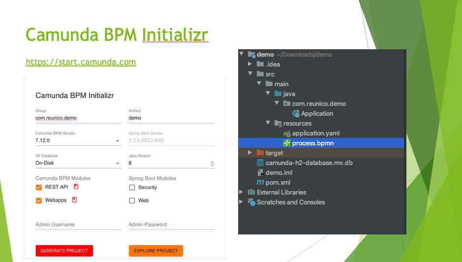
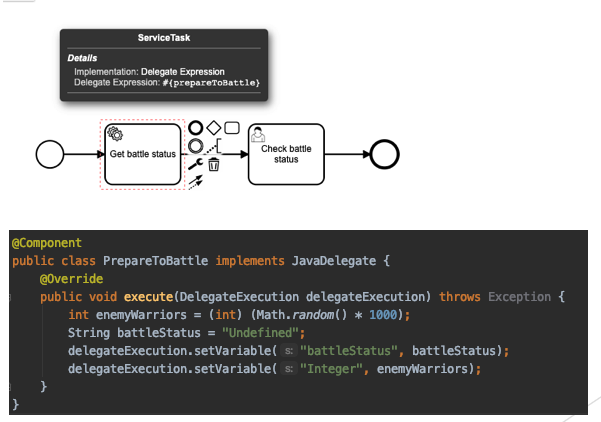

# Camunda BPM для разработчика

Добро пожаловать в проект "Camunda BPM для разработчика"! 
Наш проект - это серия воркшопов, посвященных разработке Java-приложений 
с использованием процессного движка Camunda BPM. 
 
По результатам каждого занятие будет опубликована полная запись 
(для участников воркшопа), сокращенная запись (для публикации на Youtube) и 
исходный код проекта на GitHub.  

Что необходимо иметь участнику workshop'а?

* Компьютер с правами администратора 👩🏻‍💻
* Java JDK
* Camunda Modeler последней версии: https://camunda.com/download/modeler/
* Java IDE: https://www.jetbrains.com/idea/download/
* Пиво (или любой другой бодрящий напиток) 🍻

## Занятие 1: Печенеги vs Половцы


Цели - научиться:

* Настраивать проект Camunda при помощи Camunda Boot Starter
* Создавать и разворачивать процесс
* Создавать Java код и связывать его с Camunda
* Работать с данными в процессе
* Обрабатывать события BPMN

### Шаг 1: Сгенерировать проект Camunda с использованием Camunda BPM Initialzr

Необходимо открыть страницу по ссылке: https://start.camunda.com
Задать настройки проекта и нажать Generate Project.



Полученный архив с именем приложения распаковать и открыть в IDE. Например в IDEA - Import project - as Maven project.
После открытия проекта - дождаться, пока Maven скачает зависимости. После, запустить приложение:
```
src/main/java/имя_приложения/Application.java > нажать правой кнопкой > Run
```
После запуска приложения перейти по ссылке:
http://localhost:8080/

Войти в веб-приложение Camunda, используя учетную запись:

```
Имя пользователя: demo
Пароль: demo
```

При необходимости, используемые логин и пароль можно заменить в файле resources/application.yaml.
Полный перечень настроек application.yaml доступен по ссылке: https://docs.camunda.org/manual/latest/user-guide/spring-boot-integration/configuration/#camunda-engine-properties

💪🏻 Поздравляем! Вы развернули процессное приложение Camunda!

### Шаг 2: Внести изменения в описание процесса и реализовать Java Delegate

Создать класс PrepareToBattle.java и модифицировать процесс следующим образом:


### Шаг 3: Добавить в описание процесса boundary error event и шлюз 

Пошаговое описание в видеоматериале на YouTube: https://www.youtube.com/watch?v=BHxYtmJK6MQ
 